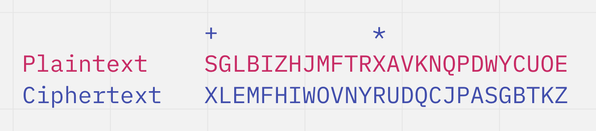
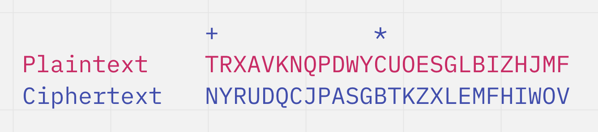
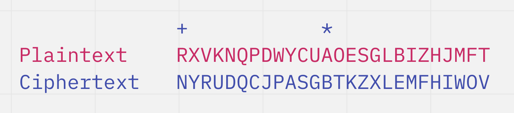

# Introduction to the Chaocipher

Invented by US Army Officer John Francis Byrne in the early 20th century, the chaocipher is a unique polyalphabetic encryption method involving just two rotating disks. This cipher was inspired by the Vigenere cipher and the Playfair cipher. He used the chaocipher to encrypt his own messages during WWI.

He tried to sell the patent for his cipher for many decades to the US government, but was unsuccessful. He published examples of ciphertext in his autobiography, *The Silent Years*. 

The algorithm remained a secret until 2010, when his daughter-in-law donated his materials to the National Cryptologic Museum.


Although this method of encryption was used originally with two disks, it is also possible to represent the algorithm in Strings instead. 

# The Encryption Algorithm

## Step 1: Set up and finding the encoded letter

In order to set up the cipher, we need two alphabets, one to locate the plaintext and the other to locate the ciphertext. The alphabets may be the same, or different. 



The ```+``` represents the zenith, or the top of the circle. The ```*``` represents the nadir, or the bottom of the circle.  

Let's say we're trying to encode the letter 'T'. We would shift both the plaintext alphabet and the ciphertext alphabet so that the 'T' on the plaintext alphabet is at the zenith. 



Now, we can see that the ciphertext character corresponding to 'T' is 'N'. That is the first character of our encrypted message. In order to prepare to encode the next character, however, we need to permute both of these alphabets. 

## Step 2: Permuting the right (plaintext) alphabet

In permuting the plaintext alphabet, we shift the alphabet to the left once. Then, we take the character at the zenith + 2 position and move it to the nadir position, pushing the characters in-between forward. 



## Step 3: Permuting the left (ciphertext) alphabet

In permuting the ciphertext alphabet, we take the character at the zenith + 1 position and move it to the nadir position, pushing the characters in-between forward.


# The Decryption Algorithm

The decryption algorithm follows the same steps as the encryption algorithm, the only difference being that you would locate the ciphertext character on the ciphertext alphabet to find the corresponding plaintext characters. All other permutation techniques remain the same. 

This is possible because the Chaocipher is permutable. 

# Security

There are two alphabets involved, each with 26 characters. This means that there are $26!$ unique alphabets, and $((26!)^2)$ unique combinations of two alphabets. However, since each alphabet rotates with the other, there can be 26 combinations of two alphabets that would essentially have an equivalent initial position. Therefore, the keyspace size is $((26!)^2 / 26)$ 

This means that it'd take a really long time to brute force a solution. 

There is only one purely ciphertext-based cryptanalysis of the Chaocipher that claims to have cracked the cipher using a divide and conquer approach. However, this journal article is behind a paywall. 


